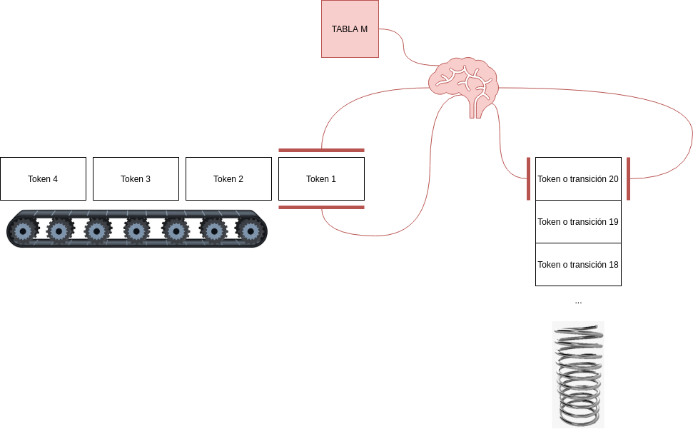

# Laboratorio 4: Resumen teórico

## Bibliografía
Louden 4.2, 3.2. Ullman 4.2.1. Apuntes de la teórica.

## Definición de gramática libre de contexto
Una grmática libre de contexto se define matematicamente como:

1. Conjunto de símbolos terminales $T$ (`if`, `int`, `{` ... )
2. Conjunto de símbolos **no** terminales $V$ (`IfStmt`, `VarDecl`, `BlockExpr`)
3. Conjunto de producciones $P$ (`BlockExpr -> { CompoundStmt }`)
4. Un símbolo inicial $S$

Una gramática es una 4-upla: $G=(V,T,P,S)$

### Notación

En el laboratorio 3 y el laboratorio 4 se usa la siguiente notación:
1. Simbolos no terminales: encerrados por `< >` por ejemplo, el símbolo llamado _expresión_ se representa como `<expresion>`
2. Símbolos terminales: sin una notación particular. El literal _if_ se escribe `if`.
3. Producciones: 
    - El símbolo no terminal que da lugar a la producción se escribe del lado izquierdo
    - El símbolo utilizado es `::=` en vez de una flecha
    - Los símbolos que tiene como resultado la producción van del lado derecho de `::=`

## Derivaciones
Consisten en transformar el símbolo inicial aplicando producciones sucesivas.

## Grmáticas ambiguas
Son aquellas que permiten llegar a cierta una secuencia de símbolos a través de distintas secuencias de aplicación de producciones. Las gramáticas ambiguas permiten interpretar el código de más de una forma, con lo cual no son utiles.

## Gramáticas LL1
Las gramáticas LL1 son aquellas que:
1. No tienen recursividad por izquierda
2. No son ambiguas

Las grmáticas LL1 se pueden utilizar facilmente en parsers LL1.

## ¿Qué es un parser LL1?

Un parser LL1 es similar al parser descendiente recursivo pero **usa un stack explícito** donde el parser recursivo descendiente utiliza el call stack.

"Partes" de un parser LL1:
1. Cola que contiene la secuencia de simbolos que se debe parsear. El parser unicamente lee de aquí, no hace push.
1. Stack de estado: Contiene la información que antes tenía el call stack
1. Tabla de transiciones _M_: Tabla de doble entrada $M \in V \times T \rightarrow P$. Esta tabla se usa cuando hay un símbolo no terminal en la punta del stack de estado. A partir del no terminal del stack de estado ($\in V$) y el primer terminal de la cola ($\in T$), define qué producción ($\in P$) aplicar.
1. "nucleo algorítmico" descripto acontinuación.



### Algoritmo de un parser LL1
```python
stack_estado=[símbolo_inicial]
cola=listado_de_tokens
while len(cola) > 0:
    if cola[0]==stack_estado[0]:
        cola.pop()
        stack_estado.pop()
    else:
        produccion = M[stack_estado[0],cola[0]]
        stack_estado.push(*produccion.lado_derecho)
```

A fines del laboratorio, escribimos el algoritmo de la siguiente manera:

```python
stack_estado=[símbolo_inicial]
cola=listado_de_tokens
def match():
    cola.pop()
    stack_estado.pop()
def apply(produccion):
    stack_estado.push(*produccion.lado_derecho)


while len(cola) > 0:
    if cola[0]==stack_estado[0]:
        match()
    else:
        apply(M[stack_estado[0],cola[0]])
```

En los ejercicios de parsing LL1 del presente laboratorio, se debe describir el listado de operaciones _match_ y _apply_ que realizaría el parser LL1.