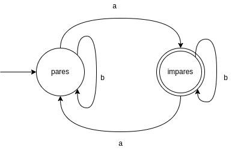

# Práctica 2 ( 30/8 )
## Orden del día
1. Repaso de DFA
2. DFA de ejemplo
3. Ejercicio de DFA de ejemplo #1
3. Ejercicio de DFA de ejemplo #2
4. Ejercicio interactivo de DFA #1
5. Ejercicio interactivo de DFA #2
7. Intervalo
8. Explicación del TP + criterio de corrección
9. Ejemplo: ejercicio 00
10. Resolver el ejercicio 01

---

## Breve repaso de DFA
Composición de un DFA:
- Alfabeto $\Sigma$
- Conjunto de estados $D$
- Función de transición $T:D\times\Sigma\rightarrow D$
- Estado inicial $S_0 \in D$
- Estados de aceptación $A \subset D$

Un DFA es una tupla $(\Sigma,D,T,S_0,A)$.

---

## Cómo visualizar un DFA
El siguiente DFA detecta un número impar de letras `a`.

---

## Cómo describir un DFA
A continuación se describe el mismo DFA sin un diagrama.

- Alfabeto $\Sigma = \{a,b\}$
- Conjunto de estados $D=\{pares, impares\}$
- Estado inicial $S_0 = pares$
- Estados de aceptación $A={impares}$
- Función de transición $T:D\times\Sigma\rightarrow D$: tabla a continuación

|estado|letra|nuevo estado|
|-|-|-|
|$pares$|$a$|$impares$|
|$pares$|$b$|$pares$|
|$impares$|$a$|$pares$|
|$impares$|$b$|$impares$|

---

## Ejercicio ejemplo 0

Dado $\Sigma = \{a,b\}$, autómata que acepte todas las palabras que tienen menos de 2 `b`
Casos de prueba:
- `aab`
- `aabaa`
- `aabaab`
- `b`
- `bbaaba`

---

## Ejercicio ejemplo 1

Dado $\Sigma = \{a,b,c,d\}$, autómata que acepte todas las palabras que contienen `abc`, y no tengan ninguna `d`. 
Casos de prueba:
- `aab`
- `aabd`
- `aabca`
- `aabcad`
- `ccca`
- `ccdca`

---

## Ejercicio interactivo  1

Dado $\Sigma = \{a,b\}$, autómata que acepte todas las palabras que contienen un número par de `a` y una `b`. 
Casos de prueba:
- `aab`
- `baa`
- `aaba`
- `bbb`

---

## Ejercicio interactivo  2

Dado $\Sigma = \{a,b,c\}$, autómata que acepte únicamente las palabras `b`, `ab`, `aba`. Todo lo demás es inválido. 
Casos de prueba:
- `bb`
- `abb`
- `abba`
- `aba`
- `ababab`

---

## Intervalo (10')

---

## Explicación TP + criterios de corrección
1. Aceptar el assignment (link ahora o en el mail luego)
2. Clonar el assignment YAYAYA
3. Puntaje (hasta 11! punto extra):
    - Pasan los test 00, 01, 02: **6ptos** (automático)
    - El ejercicio 01 **pusheado** antes de las 22 de hoy: **+1ptos** 
    - El último commit es previo al martes 23:59: **+2ptos**
    - Completar el ejercicio 99: **+2ptos**

---

## Consultas y resolución ejercicio 01
