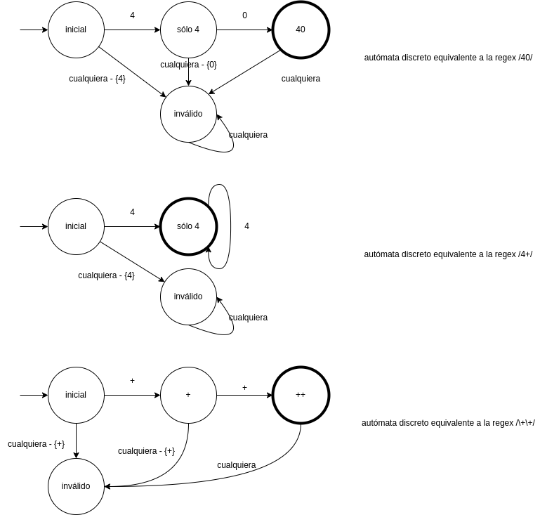

# Práctica 3 ( 7/9 )

## Orden del día
1. Qué es un lexer
5. Presentación del lenguaje 4++
2. flex
3. Repaso de DFA
4. Lexer DFA de 4++
5. Explicación lab 2 + ejemplo ejercicio 00

---

## Qué es un lexer

```c
float matchO(char *s) { /* find a zero */
    if (!strncmp(s, "0.0", 3))
    return 0.;
}
```

```python
    [
        
        (KEYWORD_FLOAT), (ID,"match0"), (LEFT_PAREN), (KEYWORD_CHAR), (STAR), (ID,"s"),(RIGHT_PAREN), (LEFT_BRACE),

        (KEYWORD_IF),(LEFT_PAREN),(BANG),(ID,"strcmp"),(LEFT_PAREN),(ID,"s"),(COMMA),(STRING,"0.0"),(COMMA),(NUM,"3"),(RIGHT_PAREN),(RIGHT_PAREN),

        (KEYWORD_RETURN),(REAL,"0."),(SEMICOLON),
        
        (RIGHT_BRACE),
        
        (EOF),
    ]
```
> Listado priorizado de expresiones regulares (siempre gana el match más largo)

---

## Lenguaje: 4++

Se permite separar con `_`

| Expresión regular | tipo de token |
| ----------------- | ------------- |
| `40`              | `CUARENTA`    |
| `4+`              | `CUATROS`     |
| `\+\+`            | `MAS_MAS`     |

Ejemplos de frases válidas 

| frase | tokens |
|-|-|
|`4444++40`|`(CUATROS,4444),(MAS_MAS,++),(CUARENTA,40)`|
|`++++4444`|`(MAS_MAS,++),(MAS_MAS,++),(CUATROS,4444)`|
|`4__40`|`(CUATROS,4),(CUARENTA,40)`| |`404`|`(CUARENTA,40),(CUATROS,4)`|

---

## Intro a flex

```
sudo apt install flex
```

```
flex -iI ejemplo.l && gcc -g lex.yy.c -o lexer -ll && ./lexer
```

```
%%
hola   { printf("token1 %s\n",yytext); }
1      { printf("token2 %s\n",yytext); }
.      { printf("ERROR %s\n",yytext); }
%%
```

---

## Breve repaso de DFA
Composición de un DFA:
- Alfabeto $\Sigma$
- Conjunto de estados $D$
- Función de transición $T:D\times\Sigma\rightarrow D$
- Estado inicial $S_0 \in D$
- Estados de aceptación $A \subset D$

Un DFA es una tupla $(\Sigma,D,T,S_0,A)$.

---

## Cómo visualizar un DFA
El siguiente DFA detecta un número impar de letras `a`.


---

## Construyendo un lexer DFA para 4++

---



---


- optimista: `(CUATROS,4),(CUATROS,4),(CUATROS,4)` = `444` (y longer match rule?)
- pesimista: `44_` va al mismo lugar que `h`

---


---
## Nuevos tipos de estado:
- **Estado inicial**: separado
- **Estado tokenizable**
- **Estado inválido**
- **Estado muerto**

---
## Explicación Lab 2 + criterios de corrección
1. Aceptar el assignment (link ahora o en el mail luego)
2. Clonar el assignment YAYAYA
3. Puntaje (hasta 11! punto extra):
    - Pasan los test 00, 01, 02, 03: **6ptos** (automático)
    - El ejercicio 01 **pusheado** antes de las 22 de hoy: **+1ptos** 
    - El último commit es previo al martes 23:59: **+2ptos**
    - Agregar 5 ó más tests que digan "extra" en la descripción (debe ser en otro archivo): **+2ptos**
